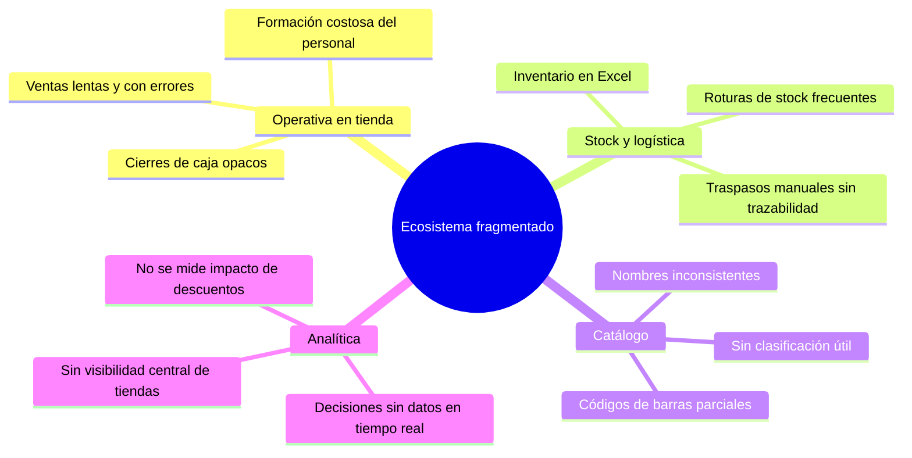
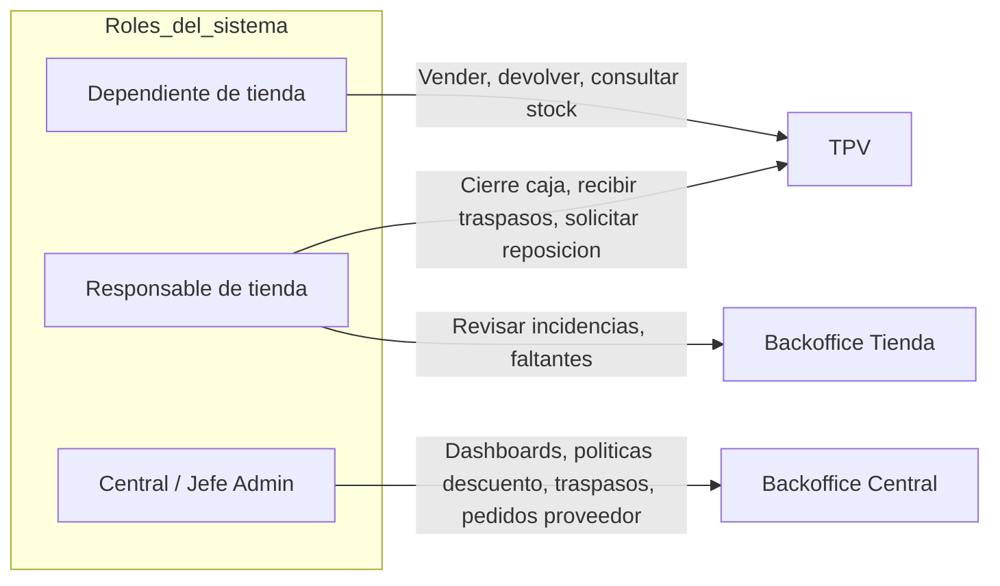
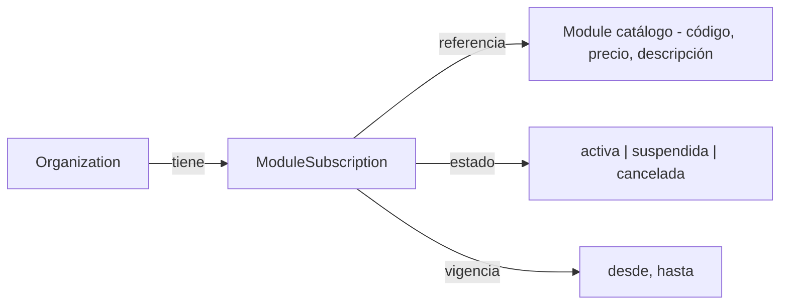
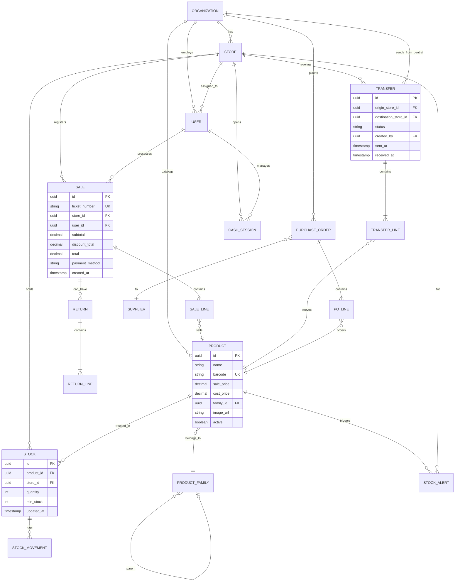
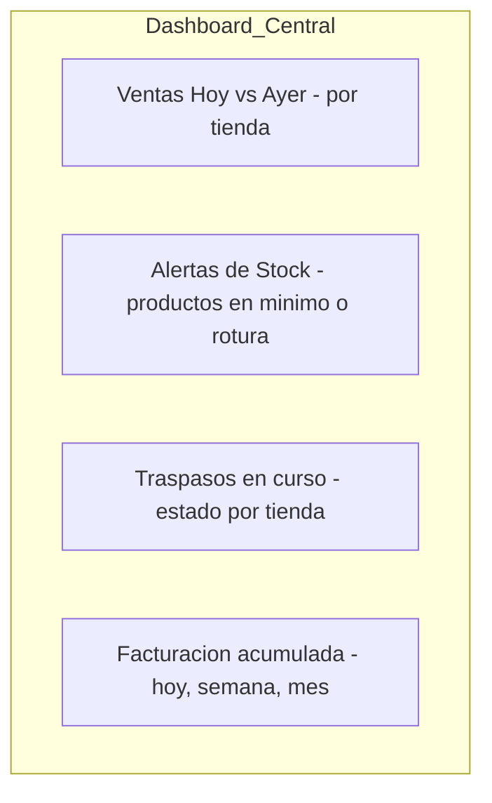
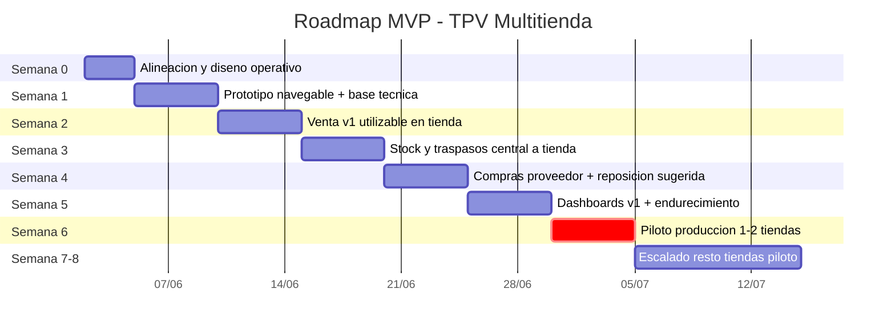

# PRD — TPV Multitienda para Retail (CBD)

| Campo | Valor |
|---|---|
| **Producto** | TPV Multitienda — Operativa de Venta |
| **Versión del documento** | 1.0 |
| **Fecha** | 27 mayo 2026 |
| **Autor** | — |
| **Estado** | Borrador para revisión |
| **Producto objetivo** | TPV SaaS multi-tenant para retail mediano multitienda (sector-agnóstico) |
| **Design partner** | Cadena retail CBD (6–7 puntos de venta) — primer cliente, validador del MVP. Relación acotada al piloto |

---

## Tabla de contenidos

1. Resumen ejecutivo
2. Problema y oportunidad
3. Propuesta de valor y diferenciación
4. Cliente objetivo e ICP
5. Usuarios, roles y permisos
6. Alcance del MVP — Requisitos funcionales
7. Requisitos no funcionales
8. Modelo de datos conceptual
9. KPIs y fórmulas
10. Dashboards y reportes
11. Estrategia de venta B2B
12. Roadmap y cronología
13. Riesgos y mitigaciones
14. Criterios de aceptación del MVP
15. Apéndices

---

## 1. Resumen ejecutivo

### Qué es

Un **TPV (Terminal Punto de Venta) multitienda SaaS multi-tenant** cuyo objetivo principal es **hacer la operación de venta sencilla, rápida y segura**, con gestión de stock como ciudadano de primera clase.

El producto se diseña como **plataforma genérica para retail mediano multitienda** (sector-agnóstico). El primer cliente —cadena CBD— actúa como *design partner* para validar el MVP, pero la arquitectura, modelo de datos y reglas de negocio no incorporan particularidades del sector CBD. Cualquier verticalización futura se entrega como módulo opcional, no como código del core.

### Pilares del MVP

| Pilar | Descripción |
|---|---|
| **Venta rápida y fiable** | Cobro ágil, búsqueda inteligente, lector de códigos, descuentos simples, devoluciones |
| **Stock en tiempo real** | Stock por tienda + central, alertas de mínimos, sugerencias de reposición |
| **Traspasos centralizados** | Central → tiendas (creación → envío → recepción → discrepancias) |
| **Pedidos a proveedor** | Propuestas automáticas basadas en ventas/rotación/mínimos |
| **Dashboards operativos** | Ventas, descuentos, márgenes, roturas de stock |

### Qué NO es (v1)

- Un ERP completo "para todo".
- Un software de contabilidad/facturación como core.
- Una herramienta documental/de gestoría.
- Un sistema de RRHH/nóminas.

> [!IMPORTANT]
> VeriFactu y factura electrónica se evalúan como requisito de cumplimiento posterior, **no** como propuesta de valor principal.

---

## 2. Problema y oportunidad

### 2.1 Dolores actuales del cliente piloto

| Dolor | Impacto en negocio | Prioridad |
|---|---|---|
| Roturas de stock frecuentes | Venta perdida, cliente insatisfecho | 🔴 Crítica |
| Ventas lentas y con errores | Menor volumen de transacciones, costes de devolución | 🔴 Crítica |
| Inventario en Excel sin tiempo real | Decisiones con datos obsoletos, sobrestock | 🟠 Alta |
| Traspasos manuales sin trazabilidad | Pérdidas, discrepancias, conflictos | 🟠 Alta |
| Catálogo inconsistente | Errores en venta, formación más larga | 🟡 Media |
| Sin dashboards operativos | Decisiones "a ojo", políticas de descuento ineficientes | 🟡 Media |

### 2.2 Oportunidad

Un TPV enfocado en **venta + stock + multitienda** permite:

- **Mejorar experiencia en caja** y reducir errores → más transacciones/hora.
- **Reducir roturas de stock** como incidente crítico → menos venta perdida.
- **Estandarizar catálogo** y formación → incorporación más rápida.
- **Dar visibilidad a central** → escalar aperturas sin caos operativo.

---

## 3. Propuesta de valor y diferenciación

| # | Diferencial | Descripción |
|---|---|---|
| 1 | **TPV "a muerte"** | El core es vender mejor, más rápido y con menos errores. No es un ERP disfrazado de TPV. |
| 2 | **Stock first-class** | La rotura de stock se trata como un *incidente crítico*: alertas, trazabilidad de eventos, KPIs dedicados. |
| 3 | **Multitienda real** | Visión centralizada + ejecución distribuida en cada tienda. Un solo backoffice para gobernar la cadena. |
| 4 | **Simplicidad operativa** | Primero lo esencial (venta/stock/logística), sin burocracia prematura. |
| 5 | **Evolución por capas** | Operativa → Laboral → Documental → Cumplimiento. Cada capa se activa solo cuando aporta valor probado. |

### Posicionamiento en una frase

> *"Vende más rápido y deja de romper stock."*

---

## 4. Cliente objetivo e ICP

### 4.1 Ideal Customer Profile (ICP)

| Atributo | Valor |
|---|---|
| **Tipo de negocio** | Cadena retail mediano con catálogo amplio y alta rotación |
| **Nº de tiendas** | 3–20 puntos de venta (en expansión) |
| **Dolores principales** | Control de stock, reposición, traspasos, reporting central |
| **Madurez digital** | Baja-media (Excel, Word, gestoría manual) |
| **Decisor (buyer)** | Director de operaciones / dueño de la cadena |
| **Usuarios diarios** | Dependientes y responsables de tienda |

> [!IMPORTANT]
> El ICP es **sector-agnóstico**. El producto debe servir a cualquier vertical de retail mediano sin cambios en el core. Las particularidades sectoriales se implementan vía módulos opcionales (ver §6.7).

### 4.2 Segmentos prioritarios (expansión)

1. **Retail especializado** (CBD, herbolarios, cosmética natural, vapeo)
2. **Alimentación gourmet / ecológica / dietética**
3. **Moda y accesorios con 5–30 tiendas**
4. **Franquicias con necesidad de control centralizado**
5. **Ferreterías / hogar / decoración con catálogo amplio**

> [!NOTE]
> El design partner es CBD pero el producto **no se especializa en CBD**. Cualquier requisito específico del sector (etiquetado, restricciones de venta, reportes legales sectoriales) se trata como módulo opcional, nunca como funcionalidad del core.

---

## 5. Usuarios, roles y permisos

### 5.1 Personas y casos de uso

#### Dependiente de tienda

| Caso de uso | Descripción | Prioridad |
|---|---|---|
| Venta rápida | Buscar producto, añadir al carrito, cobrar | 🔴 Crítica |
| Búsqueda de producto | Por nombre, código de barras, categoría | 🔴 Crítica |
| Aplicar descuento | Seleccionar descuento preconfigurado o manual (con permiso) | 🟠 Alta |
| Devolución | Registrar devolución con motivo, ajustar stock | 🟠 Alta |
| Consultar stock | Ver disponibilidad en su tienda y central | 🟡 Media |

#### Responsable de tienda

| Caso de uso | Descripción | Prioridad |
|---|---|---|
| Cierre de caja | Cuadre de caja al final del turno/día | 🔴 Crítica |
| Recepción de traspaso | Recibir mercancía de central, reportar discrepancias | 🔴 Crítica |
| Solicitar reposición | Pedir stock a central o marcar producto como urgente | 🟠 Alta |
| Revisar incidencias | Ver faltantes, anulaciones, devoluciones del día | 🟡 Media |
| Ajuste de inventario | Corrección manual con motivo (merma, rotura, error) | 🟡 Media |

#### Central / Jefe (Admin)

| Caso de uso | Descripción | Prioridad |
|---|---|---|
| Dashboard de ventas | Ventas por tienda/día/familia, hoy vs ayer | 🔴 Crítica |
| Gestión de stock global | Stock por tienda/central, alertas de mínimos | 🔴 Crítica |
| Crear traspaso | Enviar mercancía de central a tienda(s) | 🔴 Crítica |
| Pedido a proveedor | Generar propuesta automática, revisar, confirmar | 🟠 Alta |
| Gestión de catálogo | Alta/baja/edición de productos, familias, precios | 🟠 Alta |
| Políticas de descuento | Crear/editar reglas de descuento por producto/familia/tienda | 🟠 Alta |
| Dashboard de roturas | KPIs de rotura de stock, duración, productos afectados | 🟠 Alta |
| Gestión de usuarios | Alta/baja de usuarios, asignación de roles y tiendas | 🟡 Media |

### 5.2 Matriz de permisos (RBAC)

| Funcionalidad | Dependiente | Responsable | Central/Admin |
|---|---|---|---|
| Realizar venta | ✅ | ✅ | ✅ |
| Aplicar descuento manual | ⚠️ Límite % | ✅ | ✅ |
| Devolución | ✅ (con motivo) | ✅ | ✅ |
| Anulación de venta | ❌ | ✅ | ✅ |
| Consultar stock (su tienda) | ✅ | ✅ | ✅ |
| Consultar stock (otras tiendas) | ❌ | 👁️ Solo lectura | ✅ |
| Ajuste de inventario | ❌ | ✅ (con motivo) | ✅ |
| Recibir traspaso | ❌ | ✅ | ✅ |
| Crear traspaso | ❌ | ❌ | ✅ |
| Pedido a proveedor | ❌ | ❌ | ✅ |
| Dashboards operativos | ❌ | 👁️ Su tienda | ✅ Todas |
| Gestión de catálogo | ❌ | ❌ | ✅ |
| Gestión de usuarios | ❌ | ❌ | ✅ |
| Cierre de caja | ❌ | ✅ | ✅ |

---

## 6. Alcance del MVP — Requisitos funcionales

### 6.1 Módulo TPV (Venta)

#### RF-TPV-01: Búsqueda y selección de producto

| ID | Requisito | Prioridad |
|---|---|---|
| RF-TPV-01.1 | Búsqueda por nombre parcial (fuzzy) con resultados en <300ms | 🔴 P0 |
| RF-TPV-01.2 | Búsqueda por código de barras (escáner o manual) | 🔴 P0 |
| RF-TPV-01.3 | Navegación por familias/carpetas (máximo 2 niveles de anidamiento) | 🔴 P0 |
| RF-TPV-01.4 | Mostrar precio, stock disponible e imagen del producto en resultados | 🟠 P1 |
| RF-TPV-01.5 | Productos favoritos / frecuentes por tienda | 🟡 P2 |

#### RF-TPV-02: Carrito y cobro

| ID | Requisito | Prioridad |
|---|---|---|
| RF-TPV-02.1 | Añadir producto al carrito (cantidad editable) | 🔴 P0 |
| RF-TPV-02.2 | Eliminar línea del carrito | 🔴 P0 |
| RF-TPV-02.3 | Aplicar descuento por línea o por ticket (%, € fijo) | 🔴 P0 |
| RF-TPV-02.4 | Mostrar subtotal, descuentos, total en tiempo real | 🔴 P0 |
| RF-TPV-02.5 | Cobro en efectivo (cálculo de cambio) | 🔴 P0 |
| RF-TPV-02.6 | Cobro con tarjeta (integración con datáfono si aplica) | 🟠 P1 |
| RF-TPV-02.7 | Cobro mixto (parte efectivo + parte tarjeta) | 🟡 P2 |
| RF-TPV-02.8 | Impresión de ticket (térmica) o envío por email | 🟠 P1 |
| RF-TPV-02.9 | Aparcar/recuperar ticket (venta en pausa) | 🟡 P2 |

#### RF-TPV-03: Devoluciones

| ID | Requisito | Prioridad |
|---|---|---|
| RF-TPV-03.1 | Buscar ticket original por nº ticket, fecha o producto | 🔴 P0 |
| RF-TPV-03.2 | Devolución parcial (seleccionar líneas y cantidades) | 🔴 P0 |
| RF-TPV-03.3 | Motivo de devolución obligatorio (desplegable + texto libre) | 🔴 P0 |
| RF-TPV-03.4 | Ajuste automático de stock al registrar devolución | 🔴 P0 |
| RF-TPV-03.5 | Registro auditable de todas las devoluciones | 🔴 P0 |
| RF-TPV-03.6 | **Devolución sin ticket** (cliente lo perdió): buscar producto, aplicar precio actual o precio mínimo, requiere autorización de rol MANAGER+, motivo y comentario obligatorios | 🔴 P0 |
| RF-TPV-03.7 | Límite de importe diario para devoluciones sin ticket configurable por organización | 🟠 P1 |

#### RF-TPV-04: Cierre de caja

| ID | Requisito | Prioridad |
|---|---|---|
| RF-TPV-04.1 | Resumen de ventas del turno/día: efectivo, tarjeta, devoluciones | 🔴 P0 |
| RF-TPV-04.2 | Introducción de efectivo contado vs esperado (cuadre) | 🔴 P0 |
| RF-TPV-04.3 | Registro de descuadres con motivo | 🟠 P1 |
| RF-TPV-04.4 | Bloqueo del TPV tras cierre hasta nueva apertura | 🟡 P2 |

---

### 6.2 Módulo Inventario y Logística

#### RF-INV-01: Stock en tiempo real

| ID | Requisito | Prioridad |
|---|---|---|
| RF-INV-01.1 | Stock por SKU desglosado por tienda y almacén central | 🔴 P0 |
| RF-INV-01.2 | Actualización automática de stock en cada venta/devolución/traspaso/recepción | 🔴 P0 |
| RF-INV-01.3 | Vista consolidada de stock global (todas las ubicaciones) | 🟠 P1 |
| RF-INV-01.4 | Historial de movimientos por SKU (trazabilidad completa) | 🟠 P1 |

#### RF-INV-02: Alertas y stock mínimo

| ID | Requisito | Prioridad |
|---|---|---|
| RF-INV-02.1 | Configurar stock mínimo por producto y por tienda | 🔴 P0 |
| RF-INV-02.2 | Alerta automática cuando stock cae por debajo del mínimo | 🔴 P0 |
| RF-INV-02.3 | Panel de "productos en alerta" ordenado por urgencia | 🔴 P0 |
| RF-INV-02.4 | Notificación push/email a responsable de tienda y/o central | 🟡 P2 |

#### RF-INV-03: Traspasos central → tienda

| ID | Requisito | Prioridad |
|---|---|---|
| RF-INV-03.1 | Crear traspaso desde central: seleccionar tienda destino + productos + cantidades | 🔴 P0 |
| RF-INV-03.2 | Estado del traspaso: `borrador → enviado → recibido → cerrado` | 🔴 P0 |
| RF-INV-03.3 | Recepción en tienda: confirmar cantidades recibidas línea a línea | 🔴 P0 |
| RF-INV-03.4 | Reporte de discrepancias (recibido ≠ enviado) con motivo | 🔴 P0 |
| RF-INV-03.5 | Ajuste automático de stock (central baja al enviar, tienda sube al recibir) | 🔴 P0 |
| RF-INV-03.6 | Historial de traspasos con filtros (fecha, tienda, estado) | 🟠 P1 |

#### RF-INV-04: Ajustes manuales de inventario

| ID | Requisito | Prioridad |
|---|---|---|
| RF-INV-04.1 | Ajuste de stock por producto con motivo obligatorio (merma, rotura, error conteo, etc.) | 🟠 P1 |
| RF-INV-04.2 | Registro auditable de todos los ajustes | 🟠 P1 |

---

### 6.3 Módulo Compras / Proveedor

#### RF-COM-01: Propuesta de pedido

| ID | Requisito | Prioridad |
|---|---|---|
| RF-COM-01.1 | Generar propuesta automática de pedido basada en: stock actual, stock mínimo, ventas recientes, rotación | 🟠 P1 |
| RF-COM-01.2 | Edición manual de la propuesta (añadir/quitar/modificar cantidades) | 🟠 P1 |
| RF-COM-01.3 | Confirmación y envío del pedido (email o exportación) | 🟠 P1 |
| RF-COM-01.4 | Estado del pedido: `borrador → confirmado → recibido parcial → recibido completo` | 🟠 P1 |

#### RF-COM-02: Recepción de pedidos

| ID | Requisito | Prioridad |
|---|---|---|
| RF-COM-02.1 | Registrar recepción contra pedido existente | 🟠 P1 |
| RF-COM-02.2 | Recepción parcial (cantidades recibidas ≠ pedidas) | 🟠 P1 |
| RF-COM-02.3 | Actualización automática de stock central al recibir | 🟠 P1 |

---

### 6.4 Cumplimiento legal (VeriFactu)

> [!IMPORTANT]
> VeriFactu es obligatorio en España según el calendario del Real Decreto. **No es opcional ni post-MVP**: debe estar operativo antes de que el primer cliente facture en producción.

| ID | Requisito | Prioridad |
|---|---|---|
| RF-LEG-01 | Cada `Sale` genera un registro de facturación conforme al esquema VeriFactu (huella, encadenamiento, timestamp) | 🔴 P0 |
| RF-LEG-02 | Envío del registro a la AEAT (vía SOAP o proveedor certificado homologado) en el plazo legal | 🔴 P0 |
| RF-LEG-03 | Cola de reintentos persistente para envíos fallidos. Alerta a admin si la cola crece | 🔴 P0 |
| RF-LEG-04 | QR del ticket con datos VeriFactu obligatorios | 🔴 P0 |
| RF-LEG-05 | Identificador fiscal del cliente opcional (NIF/CIF) en venta para tickets > umbral legal | 🟠 P1 |
| RF-LEG-06 | Anulación de venta genera registro de anulación VeriFactu | 🔴 P0 |
| RF-LEG-07 | Devolución genera nota de abono encadenada al ticket original | 🔴 P0 |

**Decisión de implementación:** integrar con proveedor certificado homologado (TicketBai/VeriFactu — ej: Verifactu.io, Telering, etc.) en lugar de construir el conector AEAT desde cero. La capa de aplicación emite el evento, el proveedor se encarga del envío y la huella.

### 6.6 Módulo Catálogo

#### RF-CAT-01: Gestión de productos

| ID | Requisito | Prioridad |
|---|---|---|
| RF-CAT-01.1 | Alta de producto: nombre, descripción, código de barras, precio venta, coste, familia, imagen | 🔴 P0 |
| RF-CAT-01.2 | Edición y baja (soft delete) de productos | 🔴 P0 |
| RF-CAT-01.3 | Importación masiva de catálogo (CSV/Excel) | 🔴 P0 |
| RF-CAT-01.4 | **Unidad de venta**: por pieza (`UNIT`) o por peso/medida (`WEIGHT`, `VOLUME`, `LENGTH`). Cantidad en `SaleLine` debe admitir decimales para productos no-unitarios | 🔴 P0 |
| RF-CAT-01.5 | **Tipo de IVA por producto**: 0, 4, 10, 21% (configurable por país). Cálculo y desglose por tipo en cada venta | 🔴 P0 |
| RF-CAT-01.6 | Normalización de nombres/descripciones (sugerencias con IA) | 🟡 P2 |

#### RF-CAT-02: Familias/carpetas

| ID | Requisito | Prioridad |
|---|---|---|
| RF-CAT-02.1 | Estructura jerárquica de familias (máx. 2 niveles) | 🔴 P0 |
| RF-CAT-02.2 | Asignación de producto a familia | 🔴 P0 |
| RF-CAT-02.3 | Iconos/colores por familia para navegación rápida en TPV | 🟠 P1 |

---

### 6.7 Arquitectura modular y módulos opcionales

> [!IMPORTANT]
> El sistema debe ser **modular por diseño**. El core del MVP es estable y mínimo. Cualquier funcionalidad adicional se entrega como **módulo opcional activable por tenant**, sin afectar al core.

#### Core (siempre activo, incluido en suscripción base)

- TPV (venta, devoluciones, cierre de caja)
- Inventario (stock, alertas, ajustes)
- Traspasos central → tienda
- Catálogo y familias
- Dashboards básicos
- Gestión de usuarios y tiendas
- Auditoría
- VeriFactu (cumplimiento legal, no negociable)

#### Módulos opcionales (post-MVP, activables por organización)

| Módulo | Descripción | Disponibilidad estimada |
|---|---|---|
| `mod.purchases-advanced` | Reglas avanzadas de compras, contratos con proveedor, recepción por escáner | Post-MVP 1 |
| `mod.loyalty` | Clientes, tarjetas, programas de puntos | Post-MVP 2 |
| `mod.hr` | Turnos, fichaje, absentismo | Post-MVP 3 |
| `mod.documents` | Repositorio documental, vencimientos | Post-MVP 4 |
| `mod.einvoice` | Factura electrónica B2B (más allá de VeriFactu) | Post-MVP 5 |
| `mod.api` | API pública para integraciones (contabilidad, ecommerce) | Post-MVP 6 |
| `mod.offline` | Modo offline del TPV con sync | Post-MVP 7 |
| `mod.sector-cbd` | Verticalización sectorial (etiquetado, reportes específicos) | Bajo demanda |

#### Modelo de activación

| Campo | Descripción |
|---|---|
| `Module` | Catálogo de módulos disponibles: código, nombre, descripción, precio mensual |
| `ModuleSubscription` | Suscripción de un módulo por organización: estado, fechas, override de precio si aplica |
| Feature flag en runtime | El API consulta `ModuleSubscription` activa para el tenant y desbloquea endpoints/UI del módulo |
| UI | Cada módulo registra sus rutas/menús. El backoffice muestra solo los del tenant |

> [!NOTE]
> Los módulos **no pueden modificar el core**. Solo añaden tablas propias (con prefijo, ej: `loyalty_customer`, `hr_shift`) y consumen eventos del core mediante el bus interno de eventos (Redis pub/sub). Esto garantiza que el core sigue siendo simple y los módulos no se entorpecen entre sí.

---

## 7. Requisitos no funcionales

### 7.1 Rendimiento

| Requisito | Objetivo | Medición |
|---|---|---|
| Búsqueda de producto (texto/barcode) | < 200 ms (P95), < 350 ms (P99) | Telemetría server-side |
| Añadir línea al carrito (latencia percibida) | < 50 ms | Telemetría front-end |
| Registro de venta end-to-end | < 800 ms desde "cobrar" hasta confirmación | Telemetría end-to-end |
| Propagación de cambio de stock al backoffice | < 1 s vía SSE | Latencia pub→sub |
| Refresco de stock visible en otro TPV | < 2 s vía SSE | Latencia pub→sub |
| Carga inicial de TPV (FCP) | < 1.5 s en tablet de gama media | Lighthouse + RUM |
| Carga de dashboard con datos del último mes | < 2 s | Telemetría front-end |
| Tiempo medio de transacción de 3 líneas | < 45 s (objetivo de UX, no técnico) | KPI-O01 |

> [!NOTE]
> **Eliminado el polling de stock cada 30s.** El TPV se suscribe a SSE igual que el backoffice. Esto da coherencia con la promesa de "stock en tiempo real" y elimina la carga periódica innecesaria.

#### Estrategia para garantizar performance

| Capa | Estrategia |
|---|---|
| Búsqueda de producto | Índice GIN `tsvector` sobre nombre + barcode. Cache en Redis de queries frecuentes (TTL 60s, invalidación en write) |
| Carrito | Estado 100% local (Zustand) durante la composición. Solo se envía al backend en el `POST /sales` final |
| Stock en tiempo real | Postgres como fuente de verdad → trigger publica evento → Redis pub/sub → API distribuye por SSE a TPV y backoffice del tenant |
| Multi-tenant aislado | Connection pool por instancia. RLS aplicada en transacción. Sin overhead notable hasta 100+ tenants |
| Dashboards | Vistas materializadas refrescadas cada 5-15 min para KPIs costosos. Queries simples directas |
| Escalado horizontal | API stateless tras nginx. Sesiones en Redis, no en memoria. Permite añadir réplicas de API sin reconfigurar |

### 7.1.bis Escalabilidad multi-tenant

| Dimensión | Límite por tenant (MVP) | Límite global de instancia (MVP) | Estrategia para superar |
|---|---|---|---|
| Tiendas por tenant | 50 | — | Horizontal: replicar API |
| SKUs por tenant | 50.000 | — | Particionar índices por tenant en BD |
| Tenants por instancia | — | 100 | Vertical (más CPU/RAM) o split a segunda instancia |
| Transacciones/día | 5.000 | 100.000 | Réplicas de lectura para dashboards |
| Usuarios concurrentes | 100 | 2.000 | Réplicas de API + sticky sessions para SSE |

### 7.2 Disponibilidad y resiliencia

| Requisito | Objetivo |
|---|---|
| Disponibilidad del TPV | 99.5% en horario comercial (9:00–21:00) |
| Modo offline | **Fuera del MVP.** Capa futura (ver §12.3). El MVP es online-only |
| Redundancia de conectividad | Cada tienda debe disponer de **router 4G de respaldo** (recomendación obligatoria en onboarding) |
| Degradación elegante | Si la API no responde > 3s, el TPV muestra estado degradado claro al usuario y bloquea cobro hasta restablecer conexión |
| RPO (Recovery Point Objective) | < 5 minutos (vía replicación WAL continua de PostgreSQL) |
| RTO (Recovery Time Objective) | < 30 minutos |

> [!IMPORTANT]
> El MVP **requiere conexión a internet activa** en cada TPV. Esta decisión es consciente: el offline real (con resolución de conflictos de stock concurrente entre tiendas) es un problema duro que multiplicaría el alcance del MVP. Se mitiga con router 4G de respaldo en el onboarding del cliente.

### 7.3 Seguridad

| Requisito | Descripción |
|---|---|
| Autenticación | Login por usuario/contraseña + PIN rápido para cambio de turno en TPV |
| Autorización | RBAC (ver sección 5.2) |
| Auditoría | Log inmutable de: ventas, devoluciones, ajustes de stock, traspasos, cambios de catálogo, cambios de precio |
| Datos | Cifrado en tránsito (TLS 1.2+) y en reposo |
| Sesiones | Timeout configurable, cierre automático tras inactividad |

### 7.4 Escalabilidad (objetivos del producto)

Estos son los **objetivos a 12 meses para la plataforma**, agregados a través de todos los tenants. Para los límites técnicos por tenant y por instancia ver §7.1.bis.

| Dimensión | MVP (1 tenant piloto) | Objetivo 12 meses (plataforma) |
|---|---|---|
| Tenants (organizaciones) | 1 | 20–50 |
| Tiendas (suma de tenants) | 7 | 200–500 |
| Productos / SKUs (suma) | 2.000 | 200.000 |
| Transacciones/día (suma) | 500 | 50.000 |
| Usuarios concurrentes (suma) | 15 | 500 |

### 7.5 Compatibilidad y hardware

| Dispositivo | Requisito |
|---|---|
| TPV en tienda | Tablet (Android 12+ / iPad iOS 16+) o PC con Chrome / Edge / Safari ≥ 2 últimas versiones |
| Backoffice | Navegador de escritorio moderno (responsive deseable, no obligatorio) |
| Conectividad | Internet activo + router 4G de respaldo (obligatorio en onboarding) |
| Escáner | USB-HID o Bluetooth-HID (emulación de teclado), modelos validados publicados en guía |
| Impresora térmica | ESC/POS 80mm via USB o red. Modelos validados publicados en guía |
| Cajón portamonedas | Conectado a la impresora térmica (apertura por código ESC/POS) |
| Datáfono | Independiente del TPV en MVP (el dependiente confirma cobro manualmente). Integración como módulo futuro |

> [!IMPORTANT]
> En la Semana 0 del plan de desarrollo se valida el **stack de hardware concreto** (modelos exactos de impresora, escáner, tablet) con el design partner. Sin esta validación previa no se arranca la implementación del flujo de cobro.

---

## 8. Modelo de datos conceptual

### Estrategia multi-tenant

> [!IMPORTANT]
> El sistema es **multi-tenant desde el día 1**. Cada `Organization` es un tenant lógico aislado. La arquitectura debe permitir alojar decenas o centenas de organizaciones en una sola instancia, sin que ningún dato cruce fronteras de tenant.

**Modelo elegido: tenant discriminator + Row-Level Security (RLS) de PostgreSQL.**

| Decisión | Valor |
|---|---|
| Estrategia de aislamiento | **Shared database, shared schema** con `organization_id` en todas las tablas + RLS de PostgreSQL |
| Por qué no schema-per-tenant | Migraciones N veces, conexiones N veces, no escala a cientos de clientes sin operación pesada |
| Por qué no database-per-tenant | Coste operativo y de hosting prohibitivo para retail mediano. Reservado para clientes enterprise futuros |
| Cómo se inyecta el tenant | JWT contiene `organization_id`. Middleware del API hace `SET LOCAL app.current_organization_id = ...` en cada transacción |
| Verificación | Tests automáticos que intentan acceder a datos de otra org y deben fallar. Política RLS sobre cada tabla con `organization_id` |
| Backups | Un único backup global de la base. Restauración selectiva por `organization_id` mediante dump filtrado |
| Migración a DB dedicada | Cliente enterprise → export del tenant + import a instancia dedicada. Plan documentado, no en MVP |

**Tablas que necesitan `organization_id` directo:**

`Store`, `User`, `Product`, `ProductFamily`, `Supplier`, `PurchaseOrder`, `AuditLog`, `ModuleSubscription`.

**Tablas que heredan el tenant indirectamente** (vía join, pero igualmente protegidas por política RLS sobre la tabla raíz):

`Stock`, `StockMovement`, `StockAlert`, `Sale`, `SaleLine`, `Return`, `ReturnLine`, `Transfer`, `TransferLine`, `CashSession`, `PurchaseOrderLine`.

**Índice obligatorio en cada tabla con `organization_id`:** índice compuesto que empiece por `organization_id` para que cualquier query filtre primero por tenant.

### Entidades principales

| Entidad | Descripción | Campos clave adicionales |
|---|---|---|
| `Organization` | Empresa/cadena. Tenant raíz | nombre, NIF, plan |
| `Store` | Punto de venta | nombre, dirección, activa, tipo (tienda/almacén) |
| `User` | Usuario del sistema | nombre, email, PIN, rol, tiendas asignadas |
| `Product` | SKU del catálogo | nombre, barcode, precio_venta, precio_coste, familia, activo |
| `Product_Family` | Familia/carpeta | nombre, icono, color, parent_id (jerárquico) |
| `Stock` | Stock por producto × ubicación | cantidad, stock_mínimo |
| `Stock_Movement` | Log de movimientos | tipo (venta, devolución, traspaso, ajuste, recepción), cantidad, referencia, timestamp |
| `Sale` | Ticket de venta | nº ticket, tienda, usuario, total, método pago, timestamp |
| `Sale_Line` | Línea de ticket | producto, cantidad, precio_unitario, descuento, subtotal |
| `Return` | Devolución | sale_id, motivo, timestamp |
| `Transfer` | Traspaso entre ubicaciones | origen, destino, estado, timestamps |
| `Purchase_Order` | Pedido a proveedor | proveedor, estado, fecha_esperada |
| `Cash_Session` | Sesión de caja | apertura, cierre, efectivo_esperado, efectivo_contado, descuadre |
| `Stock_Alert` | Alerta de stock bajo | producto, tienda, tipo_alerta, resuelta |

---

## 9. KPIs y fórmulas

> [!NOTE]
> Todos los KPIs se calculan por **tienda**, por **cadena (global)** y por **período** (día, semana, mes). Se indica la unidad y la fórmula explícita.

### 9.1 KPIs de Venta

#### KPI-V01: Volumen de ventas (tickets)

$$
\text{Tickets}_{periodo} = \sum_{i=1}^{n} \text{Venta}_i \quad \text{donde } \text{Venta}_i.\text{estado} = \text{completada}
$$

- **Unidad:** nº de tickets
- **Granularidad:** por tienda, por día/semana/mes
- **Uso:** Comparativa hoy vs ayer, tendencia semanal

#### KPI-V02: Facturación bruta

$$
\text{Facturación Bruta}_{periodo} = \sum_{i=1}^{n} \text{Venta}_i.\text{subtotal} \quad \text{(antes de descuentos)}
$$

- **Unidad:** € (euros)

#### KPI-V03: Facturación neta

$$
\text{Facturación Neta}_{periodo} = \sum_{i=1}^{n} \text{Venta}_i.\text{total} \quad \text{(después de descuentos)}
$$

- **Unidad:** € (euros)

#### KPI-V04: Ticket medio

$$
\text{Ticket Medio} = \frac{\text{Facturación Neta}_{periodo}}{\text{Tickets}_{periodo}}
$$

- **Unidad:** €/ticket
- **Uso:** Evaluar upselling, impacto de promociones

#### KPI-V05: Unidades por ticket

$$
\text{UPT} = \frac{\sum_{i=1}^{n} \text{Venta}_i.\text{total\_unidades}}{\text{Tickets}_{periodo}}
$$

- **Unidad:** unidades/ticket
- **Uso:** Cross-selling, eficiencia de venta

#### KPI-V06: Tasa de descuento

$$
\text{Tasa Descuento} = \frac{\text{Facturación Bruta} - \text{Facturación Neta}}{\text{Facturación Bruta}} \times 100
$$

- **Unidad:** %
- **Uso:** Impacto de políticas de descuento en facturación

#### KPI-V07: Importe total de descuentos

$$
\text{Descuentos Totales}_{periodo} = \sum_{i=1}^{n} \text{Venta}_i.\text{descuento\_total}
$$

- **Unidad:** €
- **Uso:** Control de margen, auditoría de descuentos

#### KPI-V08: Tasa de devolución

$$
\text{Tasa Devolución} = \frac{\text{Nº Devoluciones}_{periodo}}{\text{Tickets}_{periodo}} \times 100
$$

- **Unidad:** %
- **Uso:** Calidad de venta, errores de dependiente, problemas de producto

#### KPI-V09: Importe de devoluciones

$$
\text{Devoluciones}_{periodo} = \sum_{j=1}^{m} \text{Devolución}_j.\text{importe}
$$

- **Unidad:** €

#### KPI-V10: Ventas por hora (productividad de tienda)

$$
\text{Ventas/hora} = \frac{\text{Tickets}_{dia}}{\text{Horas Apertura}_{dia}}
$$

- **Unidad:** tickets/hora
- **Uso:** Dimensionar personal, identificar horas pico

#### KPI-V11: Comparativa hoy vs ayer

$$
\Delta\text{Ventas} = \frac{\text{Facturación Neta}_{hoy \text{ (hasta hora actual)}} - \text{Facturación Neta}_{ayer \text{ (misma hora)}}}{\text{Facturación Neta}_{ayer \text{ (misma hora)}}} \times 100
$$

- **Unidad:** %
- **Uso:** Alerta temprana de desviaciones en tiempo cuasi-real

---

### 9.2 KPIs de Stock y Logística

#### KPI-S01: Tasa de rotura de stock

$$
\text{Tasa Rotura} = \frac{\text{Nº SKUs con stock} = 0 \text{ (durante periodo)}}{\text{Nº SKUs activos}} \times 100
$$

- **Unidad:** %
- **Uso:** Indicador principal de salud logística. **Objetivo: < 5%**

#### KPI-S02: Eventos de rotura de stock

$$
\text{Eventos Rotura}_{periodo} = \sum_{k=1}^{p} \mathbb{1}[\text{Stock}_{k}.\text{cantidad} = 0 \land \text{Stock}_{k}.\text{cantidad}_{t-1} > 0]
$$

- **Unidad:** nº de eventos
- **Uso:** Frecuencia de rotura (cada vez que un SKU pasa de >0 a 0)

#### KPI-S03: Duración media de rotura

$$
\text{Duración Media Rotura} = \frac{\sum_{k=1}^{p} (\text{timestamp\_reposición}_k - \text{timestamp\_rotura}_k)}{p}
$$

- **Unidad:** horas (o días)
- **Uso:** Velocidad de reacción logística. **Objetivo: < 24h**

#### KPI-S04: Venta perdida estimada por rotura

$$
\text{Venta Perdida}_k = \text{Duración Rotura}_k \times \text{Venta Media Diaria del SKU}_k \times \text{Precio Venta}_k
$$

$$
\text{Venta Perdida Total}_{periodo} = \sum_{k=1}^{p} \text{Venta Perdida}_k
$$

- **Unidad:** €
- **Uso:** Cuantificar impacto económico de las roturas

#### KPI-S05: Cobertura de stock (días)

$$
\text{Cobertura}_{producto, tienda} = \frac{\text{Stock Actual}}{\text{Venta Media Diaria (últimos 30d)}}
$$

- **Unidad:** días
- **Uso:** ¿Cuántos días aguanta el stock actual? Alerta si < stock mínimo equivalente

#### KPI-S06: Rotación de stock

$$
\text{Rotación}_{periodo} = \frac{\text{Coste de Ventas}_{periodo}}{\text{Stock Medio Valorado}_{periodo}}
$$

$$
\text{donde: Stock Medio Valorado} = \frac{\text{Stock Inicio} + \text{Stock Final}}{2} \times \text{Precio Coste}
$$

- **Unidad:** veces/período
- **Uso:** Productos con baja rotación → riesgo de sobrestock. Alta rotación → priorizar reposición

#### KPI-S07: Precisión de inventario

$$
\text{Precisión} = \frac{\text{Nº SKUs donde Stock Sistema} = \text{Stock Real (conteo)}}{\text{Nº SKUs contados}} \times 100
$$

- **Unidad:** %
- **Uso:** Fiabilidad de los datos del sistema. **Objetivo: > 95%**

#### KPI-S08: Tasa de discrepancia en traspasos

$$
\text{Tasa Discrepancia} = \frac{\text{Traspasos con al menos 1 línea discrepante}}{\text{Traspasos recibidos}_{periodo}} \times 100
$$

- **Unidad:** %

---

### 9.3 KPIs de Margen y Rentabilidad

#### KPI-M01: Margen bruto

$$
\text{Margen Bruto} = \text{Facturación Neta} - \text{Coste de Ventas}
$$

$$
\text{donde: Coste de Ventas} = \sum_{i=1}^{n} \sum_{j=1}^{m_i} \text{Línea}_{ij}.\text{cantidad} \times \text{Producto}_{j}.\text{precio\_coste}
$$

- **Unidad:** €

#### KPI-M02: % de margen bruto

$$
\%\text{Margen Bruto} = \frac{\text{Margen Bruto}}{\text{Facturación Neta}} \times 100
$$

- **Unidad:** %
- **Uso:** Salud del negocio. Desglosar por familia, tienda, producto

#### KPI-M03: Margen tras descuentos (impacto real)

$$
\text{Margen Perdido por Descuento} = \text{Facturación Bruta} - \text{Facturación Neta}
$$

$$
\%\text{Margen Real} = \frac{\text{Facturación Neta} - \text{Coste de Ventas}}{\text{Facturación Bruta}} \times 100
$$

- **Unidad:** %
- **Uso:** ¿Cuánto margen real queda después de descuentos sobre el potencial bruto?

#### KPI-M04: Merma y pérdida

$$
\text{Merma}_{periodo} = \sum_{a=1}^{q} \text{Ajuste}_a.\text{cantidad} \times \text{Producto}_a.\text{precio\_coste} \quad \text{donde motivo} \in \{\text{merma, rotura, caducidad}\}
$$

- **Unidad:** €
- **Uso:** Pérdidas no asociadas a venta

---

### 9.4 KPIs de Compras y Proveedor

#### KPI-C01: Lead time de reposición

$$
\text{Lead Time} = \text{Fecha Recepción Pedido} - \text{Fecha Confirmación Pedido}
$$

- **Unidad:** días
- **Uso:** Velocidad del proveedor. Impacta cálculo de stock mínimo

#### KPI-C02: Tasa de cumplimiento del proveedor (fill rate)

$$
\text{Fill Rate} = \frac{\text{Unidades Recibidas}}{\text{Unidades Pedidas}} \times 100
$$

- **Unidad:** %
- **Uso:** Fiabilidad del proveedor. **Objetivo: > 95%**

#### KPI-C03: Frecuencia de pedidos

$$
\text{Frecuencia} = \frac{\text{Nº Pedidos Confirmados}_{periodo}}{\text{Semanas en Periodo}}
$$

- **Unidad:** pedidos/semana

---

### 9.5 KPIs Operativos

#### KPI-O01: Tiempo medio de transacción

$$
\text{TMT} = \frac{\sum_{i=1}^{n} (\text{Venta}_i.\text{timestamp\_cierre} - \text{Venta}_i.\text{timestamp\_inicio})}{n}
$$

- **Unidad:** segundos
- **Uso:** Eficiencia del TPV y del dependiente. **Objetivo: < 60s para ticket de 3 líneas**

#### KPI-O02: Tasa de anulación

$$
\text{Tasa Anulación} = \frac{\text{Ventas Anuladas}_{periodo}}{\text{Ventas Totales}_{periodo}} \times 100
$$

- **Unidad:** %
- **Uso:** Errores de operativa. **Alerta si > 3%**

#### KPI-O03: Descuadre de caja

$$
\text{Descuadre} = \text{Efectivo Contado} - \text{Efectivo Esperado (según sistema)}
$$

- **Unidad:** €
- **Uso:** Control de caja. **Alerta si |Descuadre| > 5€**

#### KPI-O04: Adopción del sistema

$$
\text{Adopción} = \frac{\text{Ventas registradas en el nuevo TPV}}{\text{Ventas totales (todos los canales)}} \times 100
$$

- **Unidad:** %
- **Uso:** Progresión de migración. **Objetivo: 100% en semana 8**

---

### 9.6 Resumen de KPIs con objetivos

| KPI | Fórmula resumida | Objetivo |
|---|---|---|
| Tasa de rotura de stock | SKUs en 0 / SKUs activos | < 5% |
| Duración media de rotura | Promedio horas en stock = 0 | < 24h |
| Tiempo medio de transacción | Promedio duración venta | < 60s (3 líneas) |
| Tasa de devolución | Devoluciones / Tickets | < 3% |
| Tasa de descuento | (Bruto − Neto) / Bruto | Monitorizar |
| % Margen bruto | Margen / Facturación Neta | > X% (definir con piloto) |
| Precisión de inventario | SKUs correctos / SKUs contados | > 95% |
| Fill rate proveedor | Recibido / Pedido | > 95% |
| Descuadre de caja | Contado − Esperado | < 5€ |
| Adopción | Ventas en TPV nuevo / Total | 100% (sem. 8) |

---

## 10. Dashboards y reportes

### 10.1 Dashboard en tiempo real (Central)

| Widget | Datos | Actualización |
|---|---|---|
| Ventas hoy vs ayer (por tienda) | Facturación neta acumulada hora a hora | Cada 5 min |
| Semáforo de stock | Productos en alerta (amarillo) o rotura (rojo) por tienda | Cada venta/traspaso |
| Ticket medio hoy | Ticket medio del día vs media últimos 7 días | Cada 15 min |
| Traspasos en curso | Estado de traspasos pendientes de recepción | Evento |
| Top 10 productos vendidos hoy | Ranking por unidades o facturación | Cada 15 min |

### 10.2 Dashboard de análisis (Central, semanal/mensual)

| Reporte | Contenido |
|---|---|
| Ventas por familia/carpeta | Facturación, unidades, margen por familia. Comparativa entre períodos |
| Impacto de descuentos | Tasa de descuento por tienda/familia, correlación descuento vs volumen |
| Roturas de stock | Eventos, duración, venta perdida estimada, productos más afectados |
| Rotación de stock | SKUs por rango de rotación (alta / media / baja / muerta) |
| Rendimiento por tienda | Ranking de tiendas por: facturación, margen, roturas, descuadres |

### 10.3 Dashboard de tienda (Responsable)

| Widget | Datos |
|---|---|
| Resumen del día | Tickets, facturación, devoluciones, descuadre de caja |
| Stock bajo | Productos por debajo de mínimo en SU tienda |
| Traspasos pendientes | Traspasos enviados pero no recibidos |
| Actividad de equipo | Ventas por dependiente (si aplica) |

---

## 11. Estrategia de venta B2B

### 11.1 Posicionamiento

| Aspecto | Definición |
|---|---|
| **Categoría** | TPV multitienda SaaS para retail |
| **Mensaje principal** | *"Vende más rápido y deja de romper stock"* |
| **Audiencia** | Directores de operaciones y dueños de cadenas retail (3–20 tiendas) |
| **Diferencial competitivo** | Stock como ciudadano de primera clase + simplicidad operativa vs ERPs pesados |

### 11.2 Modelo de pricing

| Concepto | Descripción | Precio orientativo |
|---|---|---|
| **Setup / Onboarding** (pago único) | Implantación, importación de catálogo, configuración, formación | 500–1.500 € |
| **Suscripción base** (mensual por tienda) | TPV + Inventario + Traspasos + Dashboards | 79–149 €/tienda/mes |
| **Módulos opcionales** | Compras avanzadas, RRHH, Documental, VeriFactu | 20–50 €/módulo/tienda/mes |
| **Soporte premium** | SLA garantizado, soporte telefónico, formación continua | 10–20% sobre suscripción |

> [!TIP]
> **Estrategia de piloto:** Precio reducido o "design partner" (ej: 50% descuento 6 meses) a cambio de uso intensivo, feedback semanal y caso de éxito publicable.

### 11.3 Estrategia Go-To-Market (GTM)

#### Fase 1: Validación con piloto (Meses 1–2)

| Acción | Objetivo |
|---|---|
| Despliegue con cliente piloto CBD | Validar producto, obtener métricas de impacto |
| Demos semanales con piloto | Iterar sobre fricciones reales |
| Documentar caso de éxito | Métricas antes/después (roturas, tiempos, errores) |

#### Fase 2: Primeros clientes (Meses 3–6)

| Canal | Acción | Objetivo |
|---|---|---|
| **Referencia directa** | Piloto refiere a otros dueños de cadenas en su sector | 2–3 clientes |
| **Contenido / Inbound** | Blog + LinkedIn: artículos sobre gestión de stock en retail, roturas, operativa | Generar leads cualificados |
| **Eventos sector** | Asistencia a ferias de retail / CBD / franquicias | Visibilidad y demos presenciales |
| **Outbound dirigido** | Prospección a cadenas retail 5–20 tiendas con dolor evidente | Pipeline de 10–15 leads |

#### Fase 3: Escalado (Meses 6–12)

| Canal | Acción |
|---|---|
| **Partnerships** | Alianzas con consultoras de retail, distribuidores de hardware POS |
| **Canal indirecto** | Resellers / integradores que trabajan con cadenas retail |
| **Producto como canal** | Invitar a proveedores de las cadenas a ver datos de pedidos → tracción desde supply side |

### 11.4 Proceso de venta B2B

#### Ciclo de venta estimado

| Fase | Duración | Responsable |
|---|---|---|
| Prospección → Demo | 1–2 semanas | Founder / Ventas |
| Demo → Piloto | 1–2 semanas | Founder / Producto |
| Piloto → Cierre | 2–4 semanas | Founder / Ventas |
| **Total** | **4–8 semanas** | — |

### 11.5 Materiales de venta

| Material | Formato | Contenido |
|---|---|---|
| **Deck comercial** | PDF / Presentación | Problema → Solución → Demo visual → Pricing → Caso de éxito |
| **One-pager** | PDF 1 página | Propuesta de valor, 3 KPIs clave del piloto, pricing |
| **Demo interactiva** | Entorno demo con datos simulados | Flujo de venta + dashboard + alertas de stock |
| **Caso de éxito** | PDF / Web | Piloto CBD: métricas antes/después, testimonial |
| **ROI calculator** | Spreadsheet / Web | Input: nº tiendas, roturas actuales, tickets/día → Output: ahorro estimado |

### 11.6 Métricas de venta B2B

| KPI Comercial | Fórmula | Objetivo |
|---|---|---|
| **MRR (Monthly Recurring Revenue)** | Σ suscripciones mensuales activas | — |
| **ARR (Annual Recurring Revenue)** | MRR × 12 | — |
| **CAC (Customer Acquisition Cost)** | Costes ventas+marketing / Nuevos clientes | < 3 × MRR del cliente |
| **LTV (Lifetime Value)** | ARPU × Vida media del cliente (meses) | LTV/CAC > 3 |
| **Churn Rate** | Clientes perdidos / Clientes inicio período | < 5% mensual |
| **Net Revenue Retention** | (MRR inicio + expansión − contracción − churn) / MRR inicio | > 100% |
| **Pipeline** | Valor de oportunidades activas por fase | — |
| **Win Rate** | Deals cerrados / Deals cualificados | > 25% |
| **Time to Value** | Días desde firma hasta primera venta en TPV | < 14 días |

---

## 12. Roadmap y cronología

### 12.1 Cronología del MVP (2 desarrolladores)

### 12.2 Hitos de negocio

| Hito | Semana | Entregable |
|---|---|---|
| **Hito A: V1 vendible** | Fin semana 5 | TPV + stock + traspasos + compras + dashboards básicos |
| **Hito B: Piloto estable** | Fin semana 8 | Adopción mayoritaria, KPIs medibles, caso de éxito |
| **Hito C: Primer cliente de pago** | Mes 3 | Contrato SaaS firmado con segundo cliente |
| **Hito D: 5 clientes activos** | Mes 6 | Validación de escalabilidad del producto y soporte |

### 12.3 Roadmap post-MVP (módulos opcionales)

Todos los módulos post-MVP se entregan bajo la arquitectura modular descrita en §6.5. Cada módulo es activable por tenant, factura aparte y no modifica el core.

| Fase | Módulo (código) | Descripción | Trigger para desarrollar |
|---|---|---|---|
| Post-MVP 1 | `mod.purchases-advanced` | Reglas avanzadas de compras, contratos, recepción por escáner | Feedback piloto |
| Post-MVP 2 | `mod.loyalty` | Fidelización, clientes, puntos | Demanda de >2 clientes |
| Post-MVP 3 | `mod.hr` | Turnos, fichaje, absentismo | Demanda + datos disponibles |
| Post-MVP 4 | `mod.documents` | Gestoría documental, vencimientos | Demanda + no bloquea core |
| Post-MVP 5 | `mod.einvoice` | Factura electrónica B2B (más allá de VeriFactu) | Demanda B2B |
| Post-MVP 6 | `mod.api` | API pública para integraciones (contabilidad, ecommerce) | Tracción de mercado |
| Post-MVP 7 | `mod.offline` | Modo offline del TPV (Service Worker + IndexedDB + sync con resolución de conflictos) | Demanda de tiendas con conectividad inestable |
| Bajo demanda | `mod.sector-*` | Verticalizaciones sectoriales (CBD, alimentación, moda…) | Cliente lo pide y paga |

> [!IMPORTANT]
> **VeriFactu NO es post-MVP**. Está en el core porque entra en vigor como requisito legal antes del despliegue. Ver §6.4 y §13 R5.

---

## 13. Riesgos y mitigaciones

| # | Riesgo | Probabilidad | Impacto | Mitigación |
|---|---|---|---|---|
| R1 | Desviarse hacia ERP/gestoría antes de estabilizar caja/stock | 🟠 Alta | 🔴 Crítico | Gate de producto: solo entra lo que sube ventas o baja roturas/errores |
| R2 | Datos de catálogo inconsistentes del piloto | 🟠 Alta | 🟠 Alto | Proceso de importación + normalización + validaciones |
| R3 | Fricción en adopción por personal de tienda | 🟡 Media | 🟠 Alto | UX TPV simple, categorías claras, formación corta (60–90 min), feedback continuo |
| R4 | Incompatibilidad hardware (impresoras, escáner, datáfono) | 🟡 Media | 🟠 Alto | Definir stack de dispositivos en semana 0, prueba en tienda real en semana 2 |
| R5 | VeriFactu fuera de plazo o mal implementado → multas + cliente no puede facturar | 🟠 Alta | 🔴 Crítico | VeriFactu en el core del MVP. Integración con proveedor certificado homologado. Validación en sandbox AEAT antes del go-live |
| R6 | Caída de internet en tienda → bloqueo de venta | 🟡 Media | 🔴 Crítico | Router 4G de respaldo obligatorio en onboarding. Health-check con degradación visible. Offline real evaluado para post-MVP |
| R7 | Alcance del piloto crece sin control (feature creep) | 🟠 Alta | 🟠 Alto | Backlog priorizado, demos semanales como gate, decir "no" con datos |
| R8 | Competencia de TPV establecidos (Lightspeed, Square, etc.) | 🟡 Media | 🟡 Medio | Diferencial en stock first-class y personalización para retail CBD/nicho |

---

## 14. Criterios de aceptación del MVP

> [!IMPORTANT]
> El MVP se considera **listo para producción** cuando se cumplen TODOS los criterios P0 y al menos el 80% de los P1.

### 14.1 Criterios funcionales

| ID | Criterio | Prioridad |
|---|---|---|
| AC-01 | Un dependiente puede completar una venta de 3 productos en < 60 segundos | 🔴 P0 |
| AC-02 | El stock se actualiza en tiempo real tras cada venta, devolución y traspaso | 🔴 P0 |
| AC-03 | Las alertas de stock mínimo se generan automáticamente y son visibles en < 2 min | 🔴 P0 |
| AC-04 | Un traspaso central → tienda completa el flujo crear → enviar → recibir → cerrar | 🔴 P0 |
| AC-05 | El dashboard muestra ventas hoy vs ayer con datos del último refresh (< 15 min) | 🔴 P0 |
| AC-06 | Las devoluciones ajustan stock y quedan registradas con motivo | 🔴 P0 |
| AC-07 | El cierre de caja muestra cuadre efectivo vs sistema | 🟠 P1 |
| AC-08 | La propuesta de pedido a proveedor se genera con datos de ventas/rotación/mínimos | 🟠 P1 |
| AC-09 | El sistema soporta al menos 7 tiendas concurrentes sin degradación | 🟠 P1 |

### 14.2 Criterios no funcionales

| ID | Criterio | Prioridad |
|---|---|---|
| AC-NF-01 | Disponibilidad > 99% durante horario comercial en período de prueba (2 semanas) | 🔴 P0 |
| AC-NF-02 | Tiempo de respuesta de búsqueda de producto < 300ms (P95) | 🔴 P0 |
| AC-NF-03 | Datos de auditoría inmutables para ventas, devoluciones y ajustes de stock | 🔴 P0 |
| AC-NF-04 | El TPV detecta pérdida de conexión y bloquea cobro mostrando estado degradado en < 3s | 🔴 P0 |
| AC-NF-05 | Aislamiento multi-tenant verificado: ningún query puede devolver datos de otra organización | 🔴 P0 |

---

## 15. Apéndices

### A. Glosario

| Término | Definición |
|---|---|
| **SKU** | Stock Keeping Unit. Identificador único de un producto en el inventario |
| **Rotura de stock** | Evento en el que un producto con demanda tiene stock = 0 |
| **Traspaso** | Movimiento de mercancía entre ubicaciones (central → tienda) |
| **Ticket** | Documento de venta generado por el TPV |
| **Merma** | Pérdida de inventario por causas no comerciales (rotura, caducidad, robo) |
| **Fill rate** | % de unidades pedidas que efectivamente entrega el proveedor |
| **TPV** | Terminal Punto de Venta |
| **MRR** | Monthly Recurring Revenue (ingreso recurrente mensual) |
| **ARR** | Annual Recurring Revenue (ingreso recurrente anual) |
| **CAC** | Customer Acquisition Cost (coste de adquisición de cliente) |
| **LTV** | Lifetime Value (valor del ciclo de vida del cliente) |

### B. Stack tecnológico

> [!NOTE]
> Stack cerrado. La especificación detallada (versiones, justificación, alternativas descartadas) vive en `Plan_Desarrollo_MVP.md` §1. Esta tabla es solo resumen.

| Capa | Tecnología |
|---|---|
| Lenguaje | TypeScript end-to-end |
| Frontend TPV | React 19 + Vite + Mantine (SPA, sin PWA en MVP) |
| Frontend Backoffice | React 19 + Vite + Mantine |
| Backend API | NestJS 11 + Prisma 6 |
| Base de datos | PostgreSQL 16 (con RLS para multi-tenant) |
| Cache y pub/sub | Redis 7 |
| Tiempo real | Server-Sent Events (SSE) sobre HTTP |
| Auth | JWT (access 15min + refresh 7d) + PIN para cambio de turno |
| Hosting | VPS (Hetzner / DigitalOcean) con Docker Compose. Migración a Kubernetes cuando la carga lo justifique |
| CI/CD | GitHub Actions |
| Monitorización | Sentry (errores) + Prometheus + Grafana (sistema) |
| VeriFactu | Proveedor certificado homologado (no in-house) |

### C. Integraciones futuras (post-MVP)

| Integración | Prioridad | Descripción |
|---|---|---|
| Datáfono / pasarela de pagos | P1 | Cobro con tarjeta integrado |
| Impresora térmica | P1 | Impresión de tickets |
| Email / notificaciones | P2 | Alertas y tickets por email |
| VeriFactu | P3 | Factura electrónica certificada |
| Contabilidad (Holded, A3, etc.) | P3 | Exportación de datos contables |
| eCommerce | P3 | Sincronización de catálogo y stock |

---

> [!NOTE]
> Este documento es un **borrador vivo**. Debe revisarse semanalmente durante la fase de desarrollo del MVP y actualizarse con los aprendizajes del piloto.
